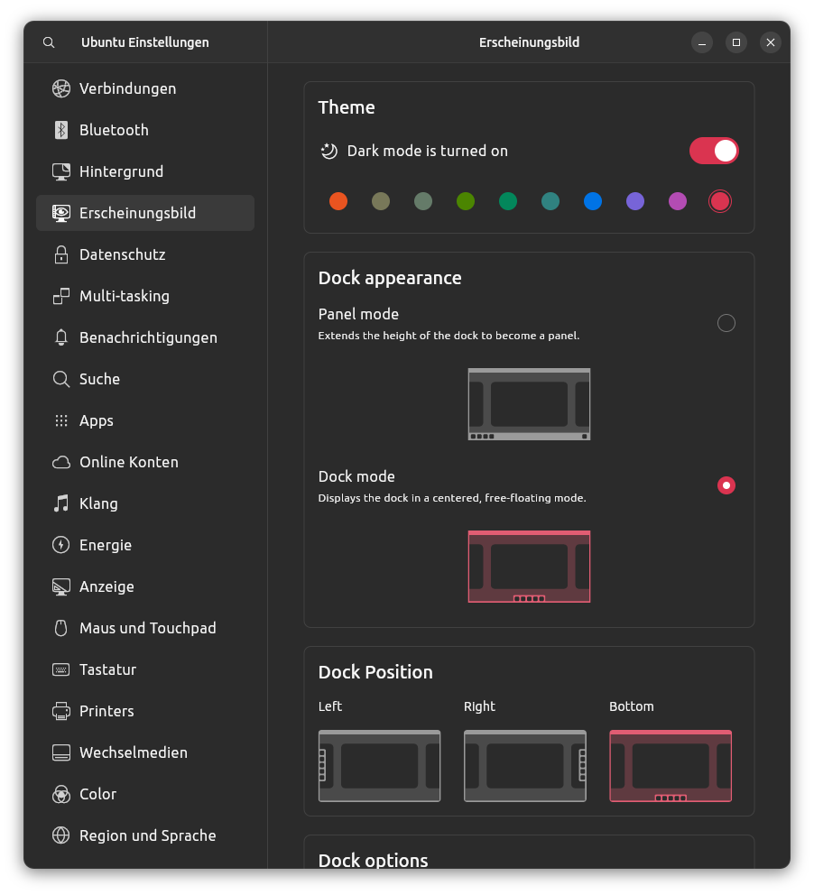

# Settings App for the Ubuntu Desktop

The goal of this project is to build a feature complete settings app for the Ubuntu desktop (GNOME, gtk and gnome-shell) with the Flutter UI toolkit.

| Light | Dark
| - | - |
|  |  |

# Releases

The app will be soon available as a snap.

# Building

The following steps are needed to run the app from the source code.

## Install Flutter

```bash
sudo apt -y install git curl cmake meson make clang libgtk-3-dev pkg-config && mkdir -p ~/development && cd ~/development && git clone https://github.com/flutter/flutter.git -b stable && echo 'export PATH="$PATH:$HOME/development/flutter/bin"' >> ~/.bashrc && source ~/.bashrc
```

##  Run

Run the app with vscode or with
```dart
flutter run
```

# TODO

- [X] use real yaru icons - thanks to @Jupi007
- [X] responsive layout
- [X] [MVVM software pattern](https://en.wikipedia.org/wiki/Model%E2%80%93view%E2%80%93viewmodel) - thanks to @jpnurmi
- [X] search
- [X] WIFI page - WIP
- [ ] Ethernet page
- [ ] Cellular Network page
- [X] Bluetooth page - WIP
- [X] Wallpaper page
- [X] Appearance page
- [X] Multi-Tasking page
- [X] Notifications page
- [ ] Search page
- [X] Apps page (forward to snap-store)
- [X] Privacy/Security page - WIP
- [ ] Online Accounts page
- [ ] Sound page - WIP    
- [X] Power page
- [X] Displays page - WIP
- [X] Mouse and touchpad page
- [X] Keyboard shortcuts page - WIP
- [ ] Printers page - WIP
- [X] Removable Media page    
- [ ] Color page
- [X] Region and language page
- [X] Accessability page
- [ ] Users page
- [ ] Preferred apps page
- [X] Date and time page
- [ ] Wacom page
- [X] Info page

## Contributing

This project really needs help to finish the last pages and also in the future when the GNOME desktop changes. Any help is welcome!


However for new contributors please follow those rules:

- do not over complicate things
- stick to the service, viewmodel, view approach
- as long as we stick to the provider package try to avoid context.watch as much as possible and always prefer context.select
- as long as we stick to the provider package try to avoid provider calls as much as possible and prefer to forward callbacks and values where you can
- do not split files with [the part keyword](https://dart.dev/guides/libraries/create-packages#organizing-a-package)
- do not shadow function definitions with [typedef](https://dart.dev/language/typedefs)
- use absolute imports
